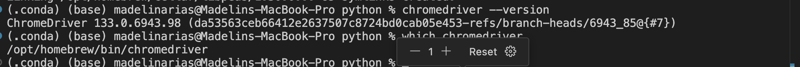
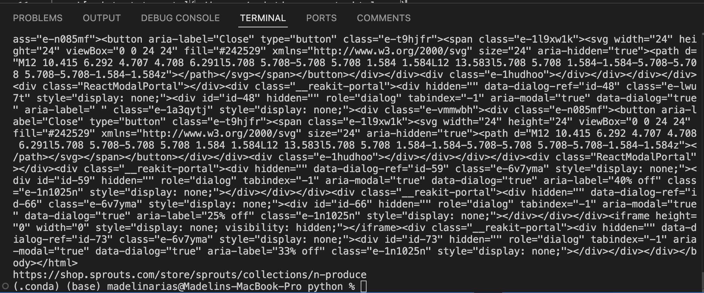

## Coding Sprouts.py
2/15/2025 
- 12:00pm PST - @madelinab - followed a tutorial on how to use selenium
2/16/2025 
- 07:00am PST - @madelinab - ran into issues getting the keys to work. StackOverflow recommended installing chromedriver through the terminal (link: https://stackoverflow.com/questions/66972241/install-chromedriver-on-mac-m1-at-specific-location)



- 10:07am PST - @madelinab - tested printing the contents of the <body> tag for a golf page. It worked. Currently, working on testing printing content using one of the sprouts categories.

- 11:19am PST - @madelinab - tried to get past the pop-up that shows up when the sprouts page loads. I've been trying to get selenium to click the 'Confirm' button, but no luck! I decided to make it print out the entire page and the url to see if it was looking at the right place. It printed the correct url, and its html content.

```
    except Exception as e:
    print(f"Error: {e}")
    print(driver.page_source)  # Prints the HTML of the current page
    print(driver.current_url)   # Prints the current URL of the page
```



- 11:40am PST - @madelinab - ...


    